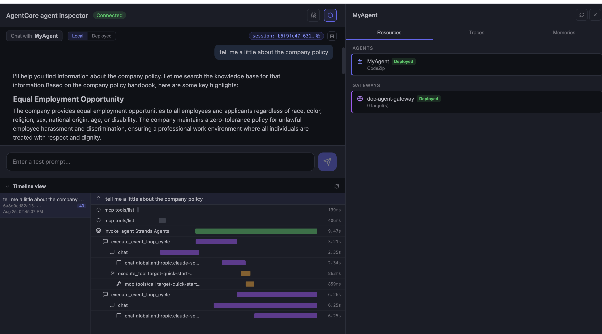

# doc-agent — Case Study

**A serverless RAG assistant on AWS that answers questions from company documents and takes real actions through an agent.**

---

## The Problem

Customer support was painful — agents answered the same questions repeatedly while customers waited. Internal knowledge was scattered across wikis, shared drives, and people's heads. New hires had no good way to get up to speed. On top of that, prompts were hardcoded into application code, making changes require full deployments with no audit trail.

---

## The Solution

doc-agent is a fully serverless AI assistant built on AWS. Documents live in S3, get chunked and embedded into a vector store via Bedrock Knowledge Bases, and are retrieved at query time by an agent running on Bedrock AgentCore. The agent answers with source citations or calls a tool (like creating a support ticket) when action is needed. When documents change, an EventBridge + Lambda pipeline re-syncs the knowledge base automatically. Prompts are versioned in Bedrock Prompt Management — no hardcoding, full audit trail.

**Stack:** Claude Sonnet 4.5 · Bedrock AgentCore · Bedrock Knowledge Bases · OpenSearch Serverless · S3 · EventBridge · Lambda · CDK · Strands (agent framework)

---

## Key Decisions

- **RAG over fine-tuning** — documents change frequently; retrieval at query time keeps answers grounded in the current source of truth and enables citations
- **Bedrock Knowledge Bases over self-managed** — managed chunking, embedding, and S3 sync removed operational overhead without meaningful flexibility tradeoff at this scale
- **LRU session cache** — up to 128 in-process sessions with conversation history, bounded to prevent memory leaks; durable session store planned as scale grows
- **Versioned prompts** — Bedrock Prompt Management replaces hardcoded prompts; every change is auditable and deployable without a code push

---

## Build Log

> This section grows with the project. Each entry captures a real problem hit, how it was diagnosed, and what was done.

### August 24 2026 — Initial Deployment

**Problem:** IAM user `BedrockAPIKey-vl76` lacked `cloudformation:DescribeStacks`, blocking the deploy. CDK bootstrap then failed with `CloudFormationStack object does not hold a stack` — the `CDKToolkit` stack was in a broken state from a prior partial run.

**Fix:** Added CloudFormation permissions to the IAM user. Deleted the broken `CDKToolkit` stack, re-ran `cdk bootstrap`, then redeployed successfully.

**Lesson:** Plan deployment IAM roles upfront. Treat CDK bootstrap as real infrastructure — a broken bootstrap stack silently blocks all future deploys.

### August 25 2026 — Gateway to Knowledge Base: CLI vs. Console

**Problem:** Connecting the Bedrock Knowledge Base to the agent through AgentCore Gateway kept failing. The `create-gateway-target` CLI command returned `AccessDeniedException` on `bedrock-agentcore:CreateGatewayTarget` — even after confirming full AdministratorAccess, no permissions boundary, no explicit deny, clean billing, and a personal (non-org) account. Standard IAM fixes didn't resolve it.

**Fix:** Diagnosed that the block wasn't an IAM permissions gap — a full admin being denied ruled out user policies, boundaries, and SCPs. Switched from the CLI to the AgentCore console, added the target to the existing gateway using the "Connectors" source type (the pre-built `bedrock-knowledge-bases` connector rather than "MCP server"), and set Outbound Auth to IAM Role (required for KB targets).

**Result:** The Knowledge Base target was created successfully. The agent now has a `Retrieve` tool exposed through the gateway, giving it grounded, cited RAG over the document set — without custom integration code.

**Lesson:** When a CLI command fails on a preview-stage AWS service despite valid permissions, the console can offer a working alternative path. The console sometimes handles connector flow and intermediate steps differently than the raw API.

### August 25 2026 — Wiring the Gateway MCP Client into the Agent

**What was done:** With the Knowledge Base connected to the gateway in the console, the next step was making the agent code actually talk to it. The gateway exposes the KB as an MCP tool over HTTP, authenticated with AWS SigV4 — so a plain `streamablehttp_client` (used for the existing Exa AI connection) wouldn't work.

**How it was integrated:**

A new `get_gateway_mcp_client()` function was added to `mcp_client/client.py` using `aws_iam_streamablehttp_client` from the `mcp-proxy-for-aws` package, which handles SigV4 signing automatically:

```python
def get_gateway_mcp_client() -> MCPClient | None:
    if not GATEWAY_URL:
        logger.warning("AGENTCORE_GATEWAY_URL not set — gateway MCP client disabled")
        return None
    return MCPClient(lambda: aws_iam_streamablehttp_client(
        endpoint=GATEWAY_URL,
        aws_region=AWS_REGION,
        aws_service="bedrock-agentcore",
    ))
```

The gateway URL is read from `AGENTCORE_GATEWAY_URL` env var — not hardcoded. For local testing, a `.env` file holds the value (excluded from git). In the deployed runtime, the env var is injected directly. `python-dotenv` loads it at startup via `load_dotenv()` in `main.py`, which is a no-op in production.

The gateway client was added alongside the existing Exa AI client in `main.py` — so the agent now has both web search and KB retrieval as tools. If `AGENTCORE_GATEWAY_URL` is not set, the function returns `None` and the agent starts without it, keeping local dev easy without the gateway.

**Lesson:** Authenticating to an AgentCore Gateway requires SigV4, not a bearer token. The `mcp-proxy-for-aws` package handles this transparently. Using an env var with a graceful `None` fallback keeps the same codebase runnable both locally and in production without config changes.

### August 25 2026 — First End-to-End RAG Test: It Works

**Milestone:** The full RAG pipeline ran successfully for the first time. Asked "tell me a little about the company policy" — the agent retrieved real policy content (equal employment opportunity, sexual harassment policy, company operations) from the Knowledge Base and answered from it, not from model training.

**What the timeline showed (ReAct loop made visible):**

- `mcp tools/list` — agent discovers the `Retrieve` tool through the gateway
- `execute_event_loop_cycle` + `chat` — model reasons it needs to look something up (2.35s)
- `execute_tool target-quick-start-...` — model calls the KB Retrieve tool (863ms) — this is the retrieval
- second `execute_event_loop_cycle` — model observes the retrieved chunks and writes the answer (6.26s)
- **1 tool used**, **5.3k tokens in / 402 out** — the input token count is the standout detail: a ~6 word question produced 5,300 input tokens because the retrieved document chunks were injected into the prompt. That large input is the "augment" step of RAG, visible as numbers.

**What this confirms:**

- S3 documents → Knowledge Base → Gateway → agent tool call → grounded answer is fully wired
- The agent reasons correctly about when to retrieve vs. answer directly
- The gateway exposes the KB as an MCP `Retrieve` tool — no custom integration code needed
- Both agent and gateway show `Deployed` in the AgentCore inspector

**Lesson:** The token count is the clearest signal that RAG is actually working. A short question with a large input token count means retrieval happened — the chunks are in the prompt. If token counts stay low on document questions, retrieval isn't firing.



### August 25 2026 — Action Tool: Agent + Lambda

**What it does:** Beyond answering questions, doc-agent can take real actions. A Lambda-backed `create_ticket` tool lets the agent open a support ticket when a user reports a problem — turning it from a Q&A bot into an assistant that does things.

**How it works:** The Strands agent runs on AgentCore Runtime and reasons about each request using the ReAct loop (reason → act → observe → answer). Its tools are exposed through AgentCore Gateway over MCP: a Knowledge Base `Retrieve` tool for grounded answers, and a `create_ticket` Lambda for actions. The agent selects the right tool based on each tool's description — routing policy questions to retrieval and problem reports to ticket creation. When it calls `create_ticket`, the gateway invokes the Lambda with the agent's chosen parameters (subject, priority), the Lambda returns a ticket ID, and the agent confirms it to the user.

**The build:** The `create_ticket` Lambda reads the tool inputs the agent passes and returns a JSON ticket result. It was registered as a Lambda MCP target on the gateway with an inline tool schema (name, description, parameters) and IAM-role outbound auth. The gateway's execution role was granted least-privilege permission to invoke the function.

**Result:** doc-agent correctly handles single-tool and multi-tool requests. In one test, a message combining a policy question and a problem report caused the agent to call both tools in a single turn — retrieving the policy answer from the Knowledge Base and creating a ticket for the issue. This demonstrates real multi-tool reasoning: the agent picks the right tool per part of the request, not just one blindly.

**Single-tool test — ticket creation only:**


*"I can't log into my account and I've tried resetting my password twice. Can you open a support ticket?"* — The agent created TICKET-FD618D29 (High priority) and confirmed it. 1 tool used, 3.0k tokens in / 259 out. The lower input token count (vs. the RAG test) confirms no KB retrieval happened — the agent correctly routed this as an action-only request.*


*Timeline shows the same ReAct pattern: tool discovery → reasoning → `execute_tool` (487ms) → answer. Total: 7.20s.*

**Multi-tool test — KB retrieval + ticket in one turn:**


*"What's the company policy on remote work? Also, my VPN keeps disconnecting...please open a ticket for it."* — The agent called both tools in a single turn: `create_ticket` for the VPN issue (TICKET-7EC9BB42, Medium priority) and `Retrieve` for the remote work policy. **2 tools used** badge confirms it. The timeline shows two back-to-back `execute_tool` calls (1.41s and 873ms) before the final answer cycle — the agent parallelised the tool calls within the same ReAct loop iteration.*

### August 26 2026 — Auto-Sync Pipeline: Keeping the Knowledge Base Current

**Problem:** In a RAG system, retrieval reads from a vector store, not directly from the source documents. So when a document changes in S3, the answers stay stale — the vectors still reflect the old content until the Knowledge Base is re-synced. Manually re-syncing after every change isn't practical for a system where documents update frequently.

**Solution:** An event-driven pipeline that re-syncs the Knowledge Base automatically whenever a document changes. When a file is added, updated, or removed in S3, an S3 event is routed through EventBridge to a Lambda function, which calls the Knowledge Base ingestion job to re-chunk and re-embed the changed content — no manual step required.

```
S3 change → EventBridge → Lambda → StartIngestionJob → KB re-syncs
```

**The build:** The Lambda uses the `bedrock-agent` client (control plane) to trigger ingestion. Two permissions were required in opposite directions: an execution role letting the Lambda call Bedrock, and a resource-based policy letting EventBridge invoke the Lambda. EventBridge notifications were enabled on the bucket, and an event rule filtered to object-created and object-deleted events for that specific bucket.

**Result:** Editing a document in S3 now triggers an automatic ingestion job with no human intervention — verified by uploading a changed file and watching an unprompted sync appear in the Knowledge Base. Documents stay fresh automatically: any change in S3 triggers a re-sync of the Knowledge Base through the event-driven pipeline, so the assistant never answers from outdated content.

**Lesson:** Stale retrieval is a silent failure — the agent answers confidently from outdated vectors with no indication anything is wrong. An event-driven sync pipeline closes that gap without adding operational burden.

---

## What's Next

Scaling to a **multi-agent system**: an orchestrator routing to specialized agents for customer support, internal knowledge, developer docs, and action execution — each with its own scoped knowledge base and tools.

---

_Built by Aakriti Dhakal_
